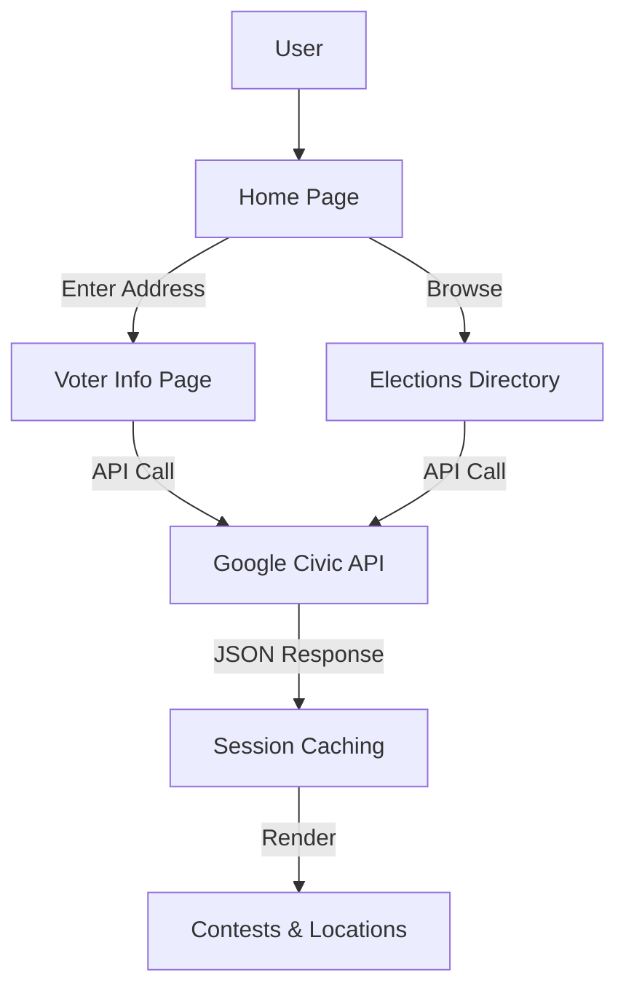

# PLEASE VOTE™

A modern, fast, and accessible voter information portal built with **React Router v7 (SPA Mode)** and **Bun**.

## 🚀 Features

- **Personalized Voter Info**: lookup polling locations, contests, and candidates by address.
- **Election Countdown**: Live countdown to the 2026 Midterm Elections.
- **Election Directory**: Searchable directory of all upcoming and past election cycles.
- **Smart Caching**: Uses `window.sessionStorage` to cache API responses for a snappier experience.
- **Accessibility First**: Built with A11y best practices and full keyboard navigation support.
- **Modern Stack**: React 19, Tailwind CSS v4, Lucide Icons, and Bun runtime.

## 🛠️ Tech Stack

- **Framework**: React Router v7 (Framework Mode / SPA)
- **Runtime**: Bun
- **Build Tool**: Vite 8
- **Styling**: Tailwind CSS v4
- **Documentation**: TypeDoc with RhineAI theme
- **API**: Google Civic Information API (VIP Spec)

## 📦 Getting Started

### Prerequisites

- [Bun](https://bun.sh) installed on your machine.
- A Google Civic Information API Key.

### Installation

1. Clone the repository.
2. Install dependencies:
   ```bash
   bun install
   ```
3. Create a `.env` file and add your API key:
   ```env
   VITE_GOOGLE_CIVIC_API_KEY=your_api_key_here
   ```

### Development

Start the development server:
```bash
bun run dev
```

### Build

Create a production build:
```bash
bun run build
```

## 📖 Documentation

API documentation is generated using TypeDoc and hosted on GitHub Pages.
To generate locally:
```bash
bunx typedoc --plugin typedoc-rhineai-theme --out ./docs
```

## 📐 Architecture & Logic



---
*Created with ❤️ by Avery Freeman*
