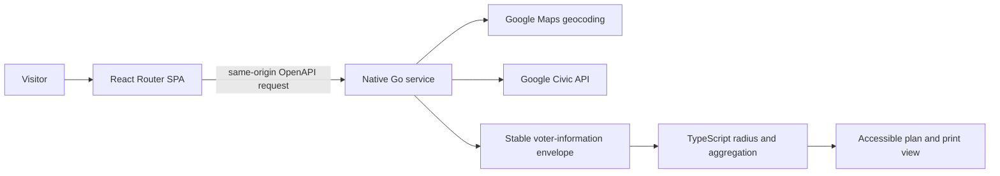

# PLEASE VOTE™

PleaseVote is a neutral, accessible voter-information portal. It helps a visitor retrieve and organize election-day locations, early voting, ballot drop-off, contests, candidates, referenda, hours, directions, and official election-administration links for an address.

It does not register voters, determine legal eligibility, endorse candidates, cast ballots, or build political profiles. Civic location records are shown as places where voting-related activity may be available; they are not silently relabelled as a single assigned polling place.

## Features

- Address-based voter-information lookup through a server-side Google Maps/Civic integration.
- Live-election preference with clearly labelled Civic VIP test-election `2000` fallback.
- Default 25-mile radius, adjustable from 5 to 50 miles, calculated from the submitted address—not a hard-coded origin.
- Election-day locations, early-vote sites, drop-off locations, hours, distance, directions, official source labels, and missing-coordinate review.
- All contests, candidates, referenda, election administration links, and a composed print/save-as-PDF voting plan.
- Separate alternate-place discovery that warns it does not establish eligibility there.
- Light, dark, and system themes; keyboard-first interaction; screen-reader semantics; reduced-motion support; axe checks.
- Optional consent companion design is intentionally separate from lookup data and is intake-only in this release.

## Architecture


```mermaid
flowchart LR
    A[Visitor] --> B[React Router SPA]
    B -->|same-origin OpenAPI request| C[Native Go service]
    C --> D[Google Maps geocoding]
    C --> E[Google Civic API]
    C --> F[Stable voter-information envelope]
    F --> G[TypeScript radius and aggregation]
    G --> H[Accessible plan and print view]
```

The frontend is React Router v7 in Vite SPA mode, built with Node 24 and pnpm. Go owns secrets, provider calls, validation, timeouts, fallback, and static-file serving. The OpenAPI contract keeps the two sides independently testable and leaves room for a future Rust/WASM implementation without making WASM a correctness dependency.

## Requirements

- Node 24 LTS
- pnpm 12
- Go 1.24 or newer (the service uses standard `net/http`)
- Google Civic Information API and Maps Geocoding API credentials loaded outside the repository

## Local development

Install the workspace:

```bash
pnpm install
```

If the project has the local secret runner, load credentials into the current shell. The script is ignored and reads secrets from outside the repository:

```bash
chmod +x ./get-keys.sh
source ./get-keys.sh
```

Start the frontend and Go service in separate terminals:

```bash
pnpm run dev
go run ./server/cmd/pleasevote-api
```

The Go service is the only component that should call Google. In production it serves `build/client` and `/api` behind nginx/TLS.

## Verification

```bash
pnpm run verify
```

The verification entrypoint runs TypeScript typechecking, unit tests, the static build, Go tests/vet, and the docs build. Individual commands:

```bash
pnpm run test:unit:coverage
pnpm run test:e2e
pnpm run test:a11y
pnpm run docs:typecheck
pnpm run docs:build
go test ./...
go vet ./...
```

Browser scenarios use deterministic fixtures. Live probes should be explicit and run only after loading credentials from outside the repository; the VIP `2000` dataset is the stable test path when current elections are empty or unavailable.

## Documentation

The purple GitHub Pages documentation covers the product specification, domain vocabulary, architecture decisions, API nodes, endpoint behavior, tests, accessibility requirements, privacy boundaries, deployment, and generated TypeDoc. The documentation unicorn is allowed to drop rainbow confetti when the test suite passes.

- Product specification: [`docs/spec.md`](docs/spec.md)
- Domain context: [`CONTEXT.md`](CONTEXT.md)
- Architecture decisions: [`docs/adr/`](docs/adr/)
- Documentation site: [`docs-site/`](docs-site/)

Created with care for voters everywhere.
