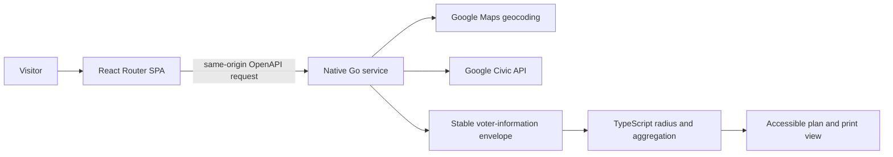

# PLEASE VOTE™

PleaseVote helps people find election information for an address: dates, places to vote, early voting, ballot drop-off, contests, candidates, hours, directions, and official election-office links.

It is an information service, not a voting service. It does not register voters, decide legal eligibility, endorse candidates, accept ballots, or build political profiles. Civic location records are shown as possible election-day locations—not as a guaranteed assigned place.

## Features

- Address-based lookup through Google Maps Platform and Google Civic Information.
- Live election data first, with Civic test election `2000` clearly marked when live voter data is unavailable.
- A 25-mile default radius, adjustable from 5 to 50 miles, measured from the submitted address.
- Election-day locations, early voting, drop-off locations, hours, distances, directions, and source labels.
- Contests, candidates, referenda, election-office links, and a print/save-as-PDF view.
- A separate lookup for another place, with a clear eligibility warning.
- Light, dark, and system themes; keyboard support; screen-reader labels; reduced-motion support; and axe checks.
- An optional consent companion kept separate from lookup data.

## Architecture


```mermaid
flowchart LR
    A[Visitor] --> B[React Router SPA]
    B -->|same-origin OpenAPI request| C[Native Go service]
    C --> D[Google Maps geocoding]
    C --> E[Google Civic API]
    C --> F[Stable voter-information envelope]
    F --> G[TypeScript radius and aggregation]
    G --> H[Accessible plan and print view]
```

The frontend is React Router v7 in Vite SPA mode, built with Node 24 and pnpm. Go handles provider calls, validation, timeouts, fallback, and static-file serving. The OpenAPI contract keeps both sides independently testable and leaves room for a future Rust/WASM implementation without making WASM a requirement.

## Requirements

- Node 24 LTS
- pnpm 12
- Go 1.24 or newer (the service uses standard `net/http`)
- A server-side credential for the [Google Maps Platform Geocoding API](https://developers.google.com/maps/documentation/geocoding)
- A server-side credential for the [Google Civic Information API](https://developers.google.com/civic-information) when using normal live-provider mode

The frontend does not need either credential. Keep both on the server and out of browser code, fixtures, logs, and commits. Local `api:debug` runs can omit the Civic credential because the embedded election `2000` fixture is available, but still need geocoding to turn the submitted address into a map origin.

## Local development

If mise is installed, prepare the pinned tools:

```bash
mise install
```

Install the workspace:

```bash
pnpm install
```

The checked-in `mise.toml` pins Node 24.21.0, pnpm 12.6.0, and Go 1.24.0 for a reproducible local toolchain. If mise is not available, install compatible Node, pnpm, and Go versions directly.

Before starting the API, configure server-side access to the [Google Maps Platform Geocoding API](https://developers.google.com/maps/documentation/geocoding) and the [Google Civic Information API](https://developers.google.com/civic-information). The frontend can run without provider credentials.

Start the frontend and Go service in separate terminals:

```bash
pnpm run dev
pnpm run api
```

For a reproducible Civic sample response at any address, use the one debug
command. It enables the embedded election `2000` fixture and detailed terminal
diagnostics; the page labels those records as sample data unrelated to the
submitted address:

```bash
pnpm run api:debug
```

The API also supports `--log-level=DEBUG|INFO|WARN|ERROR|FAILURE|OFF|DISABLED`.
Normal mode uses live Civic data only. Provider base URLs remain configurable
with `PLEASEVOTE_CIVIC_BASE_URL` and `PLEASEVOTE_GEOCODING_BASE_URL` for local
stubs and deployment; `PLEASEVOTE_ADDR` and `PLEASEVOTE_STATIC_DIR` retain
their existing meanings.

Only the Go service calls Google. In production it serves `build/client` and `/api` behind nginx/TLS.

Container packaging is available for both Go processes. Build the provider
image with `docker build --file Dockerfile --tag pleasevote:local .` and the
isolated companion with `docker build --file companion/Dockerfile --tag
pleasevote-companion:local .`. Runtime credentials belong in an external secret
manager; they are never Docker build arguments or browser variables. See the
[deployment guide](docs-site/src/content/docs/deployment.md) and
[`compose.yaml`](compose.yaml) for the separated local stack.

## Verification

```bash
pnpm run verify
```

The verification entrypoint runs the copy-policy check, TypeScript typechecking, unit tests, the static build, Go tests/vet, and the docs build. Individual commands:

```bash
pnpm run api:test
pnpm run api:race
pnpm run api:vet
pnpm run api:verify
pnpm run test:unit:coverage
pnpm run test:e2e
pnpm run test:a11y
pnpm run copy:check
pnpm run docs:typecheck
pnpm run docs:build
go test ./...
go vet ./...
```

Browser scenarios use deterministic fixtures. The VIP `2000` dataset is the stable debug path when current elections are empty or unavailable; normal provider mode does not substitute it.

## Documentation

The purple GitHub Pages documentation covers the product specification, domain vocabulary, architecture decisions, API nodes, endpoint behavior, tests, accessibility, privacy, deployment, and generated TypeDoc. The documentation unicorn drops rainbow confetti when the test suite passes.

- Product specification: [`docs/spec.md`](docs/spec.md)
- Domain context: [`CONTEXT.md`](CONTEXT.md)
- Architecture decisions: [`docs/adr/`](docs/adr/)
- Documentation site: [`docs-site/`](docs-site/)

Built to make election information easier to use.
