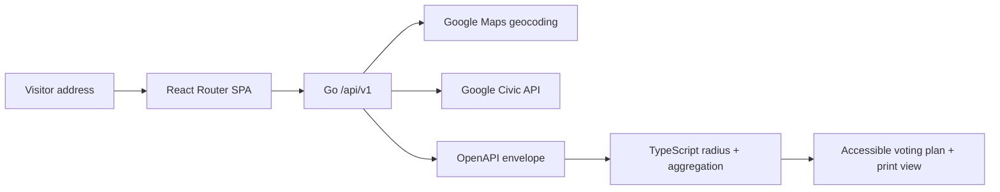

The provider layer is server-side and time-bounded. The client owns presentation and deterministic domain operations. A stable contract allows a future Rust/WASM module without changing the visitor workflow; WASM is not required for the current deployment.

The companion consent intake is a separate deployment and schema. It is not connected to lookup addresses, political preference, or PleaseVote analytics.
