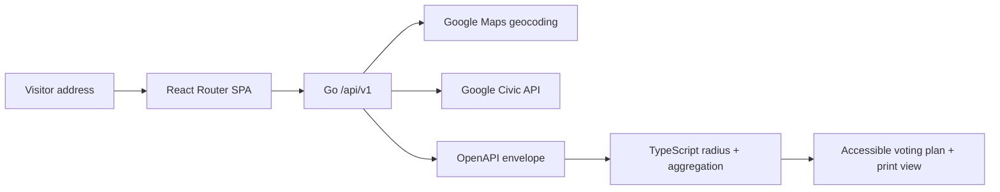

The Go service talks to Google with bounded requests. The client handles presentation and distance calculations. The OpenAPI contract leaves room for a future Rust/WASM module; WASM is not needed for the current deployment.

The consent companion is a separate service and schema. It is not connected to lookup addresses, political preferences, or PleaseVote analytics.
